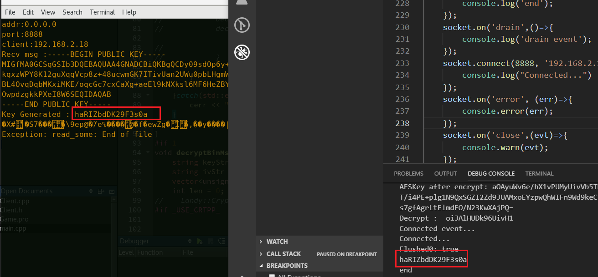

# Preface


接上篇，流程应该是这样的：

* 前后端分别生成密钥对用于RSA加解密
* 交换双方公钥：公钥用于在向对方发送信息之前对信息加密，对方可以用己方私钥来解密信息
* 服务端向客户段发送几方公钥的时候，可以顺道向对方发送己方生成的AES密钥
* 之后就是其他的事情了

# Issue

当前解决的是前端Cryptjs与后端Openssl的密钥加解密调试有问题。

仔细观察了一下 Cryptjs加密16长度字符串的流程：

* 先生成一个128byte的 bytearray，其实就是一个和array，里面存的byte
* 之后通过BigInteger和doPublic封装后变成了256 bytes的字符串
* 之后通过自定义的hextob64变成了一个172长度的字符串

之前已经将172转成256byte的字符串。

而后发现了自己思路错误。

# Content

## 服务端

新增一个生成AES key的方法：

```c+
string genAeskey(int size)
    {
        stringstream ss;
        int len = strlen(KEYMP);
        for(int i = 0; i < size; i++)
        {
            ss << KEYMP[rand()%len];
        }
        std::cout << "Key Generated : " << ss.str() << endl;
        return ss.str();
    }
```

修改Accpet方法：

```c++

void Client::Accept()
{
    try
    {
        while(true)
        {
            vector<unsigned char> buf(1024);
            size_t s = sock->read_some(boost::asio::buffer(buf));
            string s1(buf.begin(),buf.begin()+s);
            cout << "Recv msg :" << s1 << endl;
            if(key.size() == 0)
            {
                key = s1;
                string aesKey = genAeskey(16);
                RSA *rsa;//= RSA_new();
                BIO* bio = BIO_new(BIO_s_mem());
                BIO_write(bio, key.c_str(),s);
                assert(bio != NULL);
                EVP_PKEY* pkey = NULL;
                PEM_read_bio_PUBKEY(bio,&pkey,NULL,NULL);
                assert(pkey != NULL);
                rsa = EVP_PKEY_get1_RSA(pkey);
                assert(rsa != NULL);
                int len = RSA_size(rsa);
                vector<unsigned char> out(len);
                int ret = RSA_public_encrypt(aesKey.size(),(const unsigned char*)aesKey.c_str(),&out[0],rsa,RSA_PKCS1_PADDING);
                if (ret <= 0)
                {
                    out.resize(0);
                    cout << "Failure." << endl;
                    unsigned long errorcode = ERR_peek_last_error();
                    cout << "Error Code:" << errorcode << endl;
                    char errmsg[1024] = {0};
                    char *tmp1 = NULL;
                    tmp1 = ERR_error_string(errorcode,errmsg);
                    cout << errmsg << endl;
                }else
                {
                    string s(out.begin(),out.end());
                    cout << "Success : " << s << endl;
                    boost::system::error_code ec;
                    sock->write_some(boost::asio::buffer(out),ec);
                }

                EVP_PKEY_free(pkey);
                RSA_free(rsa);
                BIO_free(bio);
            }else
            {    
                cout << s1.size() << " bytes before b64 decode" << endl;
//                content = b64tohex(s1);
                content = s1;
                cout << content.size() << " bytes after b64 decode" << endl;
                cout << "Key : " << key << endl;
                cout << "Content : " << content << endl;
                RsaDecrypt();
            }
        }
    }catch(std::exception &e)
    {
        cerr << "Exception: " << e.what() << endl;
    }
}
```

## 客户端

对JSEncrypt进行了一些修改：

```js
RSAKey.prototype.decryptBin = RSADecryptBin; 
/**
 * @description decrypt bytearray
 * @param ba  target data
 */
function RSADecryptBin(ba) 
{
  let c = new BigInteger(ba);
  var m = this.doPrivate(c);
  if(m == null) return null;
  return pkcs1unpad2(m, (this.n.bitLength()+7)>>3);
};

JSEncrypt.prototype.decryptBin = function (ba) {
  // Return the decrypted string.
  try {
    return this.getKey().decryptBin(ba);
  }
  catch (ex) {
    return false;
  }
};

```

另外添加一下socket的数据接受：

```js
var rsaUtil = {
 	...
    decryptBin : function (ciphered) {
        // privatekey && rsaUtil.thisKeyPair.setPrivateKey(privatekey);
        let decstring = rsaUtil.thisKeyPair.decryptBin(ciphered);
        return decstring;
    }
}

socket.on('data',(data)=>{
    let result = rsaUtil.decryptBin(data);
    console.log(result);
});
```


新增了一个bytearray数据的RSA解析函数，与RSADecrypt差不多：

* 先用Biginteger对ba进行封装
* 然后对封装后的数据进行doPrivate
* 然后调用pkcs1unpad2方法对他进行解密

前端其实加密后的数据和openssl加密后的数据其实隔了一层Biginteger，所以把这一层认为补齐就可以了。

效果如下：


